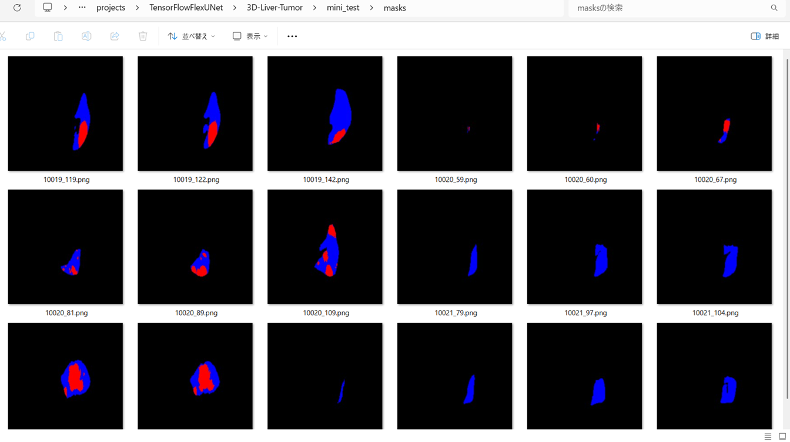
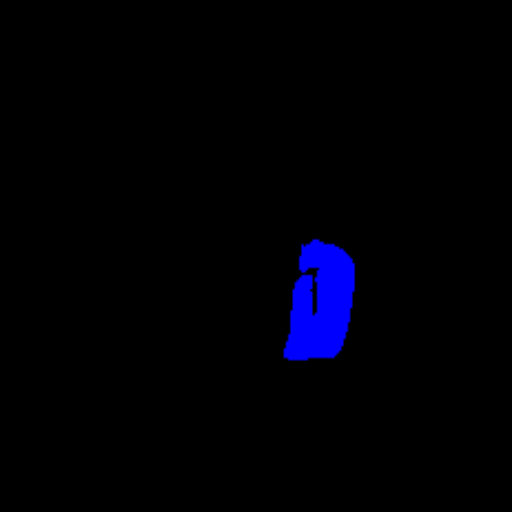
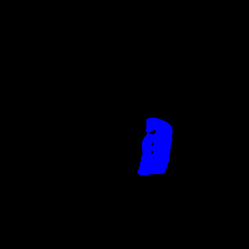

<h2>TensorFlow-FlexUNet-Image-Segmentation-3D-Liver-Tumor (2025/07/15)</h2>

This is the first experiment of Image Segmentation for 3D-Liver-Tumor based on our TensorFlowFlexUNet (TensorFlow Flexible UNet Image Segmentation Model for Multiclass) and a 512x512 pixels 
<a href="https://drive.google.com/file/d/1v38HJdj6hablEHrBWHDYtAAoVUiHdFOr/view?usp=sharing">
3D-Liver-Tumor-ImageMask-Dataset.zip</a>.
which was derived by us from  
<a href="https://www.kaggle.com/datasets/gauravduttakiit/3d-liver-and-liver-tumor-segmentation">

<b>3D Liver and Liver Tumor Segmentation</b>
</a>

 
 
<b>Acutual Image Segmentation for 512x512 3D-Liver-Tumor images</b> 
As shown below, the inferred masks look very similar to the ground truth masks. 
The blue region represents a Liver, and the red a tumor respectively.  
<table>
<tr>
<th>Input: image</th>
<th>Mask (ground_truth)</th>
<th>Prediction: inferred_mask</th>
</tr>
<tr>
<td></td>
<td></td>
<td></td>
</tr>
<tr>
<td></td>
<td></td>
<td></td>
</tr>
<tr>
<td></td>
<td></td>
<td></td>
</tr>
</table>

 
<h3>1. Dataset Citation</h3>
The dataset used here has been taken from the following kaggle website : 
<a href="https://www.kaggle.com/datasets/gauravduttakiit/3d-liver-and-liver-tumor-segmentation">
<b>3D Liver and Liver Tumor Segmentation</b>
</a>
 
Unleashing Precision Medicine through Advanced 3D Liver and Tumor Segmentation
 
 

<b>About Dataset</b> 
<b>Title</b> 
3D Liver and Liver Tumor Segmentation Dataset 
 
<b>Description:</b> 
The 3D Liver and Liver Tumor Segmentation Dataset is a comprehensive collection of medical imaging data  
designed to advance the field of liver and tumor segmentation in three-dimensional space. This dataset is  
meticulously curated to provide researchers, practitioners, and artificial intelligence developers with  
a rich resource for developing and validating robust algorithms in the domain of medical image analysis. 
 
<b>Key Features:</b> 
 
<b>Modalities:</b> The dataset encompasses a variety of medical imaging modalities, including CT (Computed  
Tomography) and MRI (Magnetic Resonance Imaging), providing a diverse set of imaging perspectives to  
enhance algorithm generalization.
 
 
<b>Patient Diversity:</b> It includes imaging data from a diverse population of patients, covering a range 
 of ages, genders, and ethnicities. This diversity ensures the dataset's relevance across different  
 demographic groups and medical scenarios.
 
<b>Annotations:</b> Each medical image in the dataset is meticulously annotated by expert radiologists to  
highlight the boundaries of the liver and identify tumor regions. These annotations serve as ground truth 
 labels for training and evaluating segmentation algorithms. 
 
<b>3D Volumes:</b> The dataset is specifically tailored for 3D segmentation tasks, offering volumetric  >
representations of liver structures and tumor regions. This reflects the real-world complexity of liver  
anatomy and pathology. 
 
<b>Pathological Variations:</b> To address the challenges posed by liver tumors of various types and sizes,  
the dataset includes a wide spectrum of pathological variations, including benign and malignant tumors.  
This diversity enables the development of algorithms capable of handling different tumor characteristics. 
 
<b>Ethical Considerations:</b> Strict adherence to privacy and ethical guidelines has been maintained  
throughout the dataset creation process. Patient identifiers are anonymized, ensuring compliance with data 
 protection regulations. 
 
<b>Usage Scenarios:</b> The dataset is suitable for a range of applications, including the development and 
 evaluation of automated segmentation algorithms, research into new medical imaging techniques, and the  
 exploration of machine learning methods for liver and tumor analysis. 

 
<b>License</b> 
<a href="https://creativecommons.org/publicdomain/zero/1.0/">
CC0: Public Domain
</a>
 

<h3>
<a id="2">
2 3D-Liver-Tumor ImageMask Dataset
</a>
</h3>
 If you would like to train this 3D-Liver-Tumor Segmentation model by yourself,
 please download the dataset from the google drive  
<a href="https://drive.google.com/file/d/1v38HJdj6hablEHrBWHDYtAAoVUiHdFOr/view?usp=sharing">
3D-Liver-Tumor-ImageMask-Dataset.zip</a>.
 
, expand the downloaded ImageMaskDataset and put it under <b>./dataset</b> folder to be
<pre>
./dataset
└─3D-Liver-Tumor
    ├─test
    │   ├─images
    │   └─masks
    ├─train
    │   ├─images
    │   └─masks
    └─valid
        ├─images
        └─masks
</pre>
 
<b>3D-Liver-Tumor Statistics</b> 
 
 
On the derivation of the dataset, please refer to our repository 
<a href="https://github.com/sarah-antillia/Image-Segmentation-Liver-Tumor">Image-Segmentation-Liver-Tumor</a>
  
<!--
On the derivation of the dataset, please refer to the following Python scripts: 
<li><a href="./generator/ImageMaskDatasetGenerator.py">ImageMaskDatasetGenerator.py</a></li>
<li><a href="./generator/split_master.py">split_master.py</a></li>
 
-->
As shown above, the number of images of train and valid datasets is large enough to use for a training set of our segmentation model.
 
 
<b>Train_images_sample</b> 

 
<b>Train_masks_sample</b> 

 
<h3>
3 Train TensorFlowFlexUNet Model
</h3>
 We trained 3D-Liver-Tumor TensorFlowFlexUNet Model by using the following
<a href="./projects/TensorFlowFlexUNet/3D-Liver-Tumor/train_eval_infer.config"> <b>train_eval_infer.config</b></a> file.  
Please move to ./projects/TensorFlowFlexUNet/3D-Liver-Tumor and run the following bat file. 
<pre>
>1.train.bat
</pre>
, which simply runs the following command. 
<pre>
>python ../../../src/TensorFlowFlexUNetTrainer.py ./train_eval_infer.config
</pre>

<b>Model parameters</b> 
Defined a small <b>base_filters = 16 </b> and large <b>base_kernels = (9,9)</b> for the first Conv Layer of Encoder Block of 
<a href="./src/TensorFlowFlexUNet.py">TensorFlowFlexUNet.py</a> 
and a large num_layers (including a bridge between Encoder and Decoder Blocks).
<pre>
[model]
;You may specify your own UNet class derived from our TensorFlowFlexModel
model         = "TensorFlowFlexUNet"
generator     =  False
image_width    = 512
image_height   = 512
image_channels = 3
num_classes    = 3

base_filters   = 16
base_kernels   = (9,9)
num_layers     = 8
dropout_rate   = 0.04
dilation       = (1,1)
</pre>
<b>Learning rate</b> 
Defined a very small learning rate.  
<pre>
[model]
learning_rate  = 0.00005
</pre>
<b>Loss and metrics functions</b> 
Specified "categorical_crossentropy" and <a href="./src/dice_coef_multiclass.py">"dice_coef_multiclass"</a>. 
<pre>
[model]
loss           = "categorical_crossentropy"
metrics        = ["dice_coef_multiclass"]
</pre>
<b>Dataset class</b> 
Specifed <a href="./src/ImageCategorizedMaskDataset.py">ImageCategorizedMaskDataset</a> class. 
<pre>
[dataset]
class_name    = "ImageCategorizedMaskDataset"
</pre>
 
<b>Learning rate reducer callback</b> 
Enabled learing_rate_reducer callback, and a small reducer_patience.
<pre> 
[train]
learning_rate_reducer = True
reducer_factor     = 0.5
reducer_patience   = 4
</pre>
<b>Early stopping callback</b> 
Enabled early stopping callback with patience parameter.
<pre>
[train]
patience      = 10
</pre>

<b>RGB Color map</b> 
rgb color map dict for 3D-Liver-Tumor 1+2 classes. 
<pre>
[mask]
mask_file_format = ".png"
; background   black  Liver:blue, tumor:red
rgb_map = {(0,0,0):0, (0,0,255):1, (255,0,0):2,}
</pre>

<b>Epoch change inference callback</b> 
Enabled <a href="./src/EpochChangeInfereuncer.py">epoch_change_infer callback</a></b>. 
<pre>
[train]
epoch_change_infer       = True
epoch_change_infer_dir   =  "./epoch_change_infer"
num_infer_images         = 6
</pre>

By using this callback, on every epoch_change, the inference procedure can be called
 for 6 images in <b>mini_test</b> folder. This will help you confirm how the predicted mask changes 
 at each epoch during your training process.    

<b>Epoch_change_inference output at starting (epoch 1,2,3)</b> 
 
 
<b>Epoch_change_inference output at middlepoint (epoch 25,26,27)</b> 
 
 
<b>Epoch_change_inference output at ending (epoch 52,53,54)</b> 
 
 
In this experiment, the training process was stopped at epoch 54 by EarlyStopping callback.  
 
 

<a href="./projects/TensorFlowFlexUNet/3D-Liver-Tumor/eval/train_metrics.csv">train_metrics.csv</a> 
 

 
<a href="./projects/TensorFlowFlexUNet/3D-Liver-Tumor/eval/train_losses.csv">train_losses.csv</a> 
 

 

<h3>
4 Evaluation
</h3>
Please move to <b>./projects/TensorFlowFlexUNet/3D-Liver-Tumor</b> folder, 
and run the following bat file to evaluate TensorFlowFlexUNet model for 3D-Liver-Tumor. 
<pre>
./2.evaluate.bat
</pre>
This bat file simply runs the following command.
<pre>
python ../../../src/TensorFlowFlexUNetEvaluator.py ./train_eval_infer_aug.config
</pre>

Evaluation console output: 

  

<a href="./projects/TensorFlowFlexUNet/3D-Liver-Tumor/evaluation.csv">evaluation.csv</a> 
The loss (categorical_crossentropy) to this 3D-Liver-Tumor/test was not low and dice_coef_multiclass 
high as shown below.
 
<pre>
categorical_crossentropy,1.3722
dice_coef_multiclass,0.9323
</pre>
 

<h3>
5 Inference
</h3>
Please move <b>./projects/TensorFlowFlexUNet/3D-Liver-Tumor</b> folder 
,and run the following bat file to infer segmentation regions for images by the Trained-TensorFlowFlexUNet model for 3D-Liver-Tumor. 
<pre>
./3.infer.bat
</pre>
This simply runs the following command.
<pre>
python ../../../src/TensorFlowFlexUNetInferencer.py ./train_eval_infer_aug.config
</pre>

<b>mini_test_images</b> 
 
<b>mini_test_mask(ground_truth)</b> 
 

<b>Inferred test masks</b> 
 
 

<b>Enlarged images and masks of 512x512 pixels</b> 

<table>
<tr>
<th>Image</th>
<th>Mask (ground_truth)</th>
<th>Inferred-mask</th>
</tr>

<tr>
<td></td>
<td></td>
<td></td>
</tr>

<tr>
<td></td>
<td></td>
<td></td>
</tr>

<tr>
<td></td>
<td></td>
<td></td>
</tr>

<tr>
<td></td>
<td></td>
<td></td>
</tr>

<tr>
<td></td>
<td></td>
<td></td>
</tr>

<tr>
<td></td>
<td></td>
<td></td>
</tr>
</table>

 
<h3>
References
</h3>
<b>1. The Liver Tumor Segmentation Benchmark (LiTS)</b> 
Patrick Bilic, Patrick Christ, Hongwei Bran Li, Eugene Vorontsov, Avi Ben-Cohen,  
Georgios Kaissis, Adi Szeskin, Colin Jacobs, Gabriel Efrain Humpire Mamani,  
Gabriel Chartrand, Fabian Lohöfer, Julian Walter Holch, Wieland Sommer, Felix Hofmann, 
Alexandre Hostettler, Naama Lev-Cohain, Michal Drozdzal, Michal Marianne Amitai, Refael Vivanti, 
Jacob Sosna, Ivan Ezhov, Anjany Sekuboyina, Fernando Navarro, Florian Kofler,  
Johannes C Paetzold, Suprosanna Shi, Xiaobin Hu, Jana Lipková, Markus Rempfler, Marie Piraud ,  
Jan Kirschke, Benedikt Wiestler, Zhiheng Zhang, Christian Hülsemeyer, Marcel Beetz, Florian Ettlinger, 
Michela Antonelli, Woong Bae, Míriam Bellver, Lei Bi, Hao Chen, Grzegorz Chlebus, Erik B Dam,  
Qi Dou, Chi-Wing Fu, Bogdan Georgescu, Xavier Giró-i-Nieto, Felix Gruen, Xu Han, Pheng-Ann Heng, 
Jürgen Hesser, Jan Hendrik Moltz, Christian Igel, Fabian Isensee, Paul Jäger, Fucang Jia,  
Krishna Chaitanya Kaluva, Mahendra Khened, Ildoo Kim, Jae-Hun Kim, Sungwoong Kim, Simon Kohl,  
Tomasz Konopczynski, Avinash Kori, Ganapathy Krishnamurthi, Fan Li, Hongchao Li, Junbo Li, Xiaomeng Li,  
John Lowengrub, Jun Ma, Klaus Maier-Hein, Kevis-Kokitsi Maninis, Hans Meine, Dorit Merhof,  
Akshay Pai, Mathias Perslev, Jens Petersen, Jordi Pont-Tuset, Jin Qi, Xiaojuan Qi, Oliver Rippel,  
Karsten Roth, Ignacio Sarasua, Andrea Schenk, Zengming Shen, Jordi Torres, Christian Wachinger, 
Chunliang Wang, Leon Weninger, Jianrong Wu, Daguang Xu, Xiaoping Yang, Simon Chun-Ho Yu, Yading Yuan,  
Miao Yue, Liping Zhang, Jorge Cardoso, Spyridon Bakas, Rickmer Braren, Volker Heinemann,  
Christopher Pal, An Tang, Samuel Kadoury, Luc Soler, Bram van Ginneken, Hayit Greenspan,  
Leo Joskowicz, Bjoern Menze      
<a href="https://pmc.ncbi.nlm.nih.gov/articles/PMC10631490/">https://pmc.ncbi.nlm.nih.gov/articles/PMC10631490/</a>
 
 
<b>2. 3D Liver Tumor Segmentation in CT Images Using Improved Fuzzy C-Means and Graph Cuts</b> 
Weiwei Wu, Shuicai Wu, Zhuhuang Zhou, Rui Zhang, Yanhua Zhang 
<a href="https://onlinelibrary.wiley.com/doi/10.1155/2017/5207685">https://onlinelibrary.wiley.com/doi/10.1155/2017/5207685</a>
 
 
<b>3. Multi-Scale Convolutional Attention and Structural Re-Parameterized Residual-Based 3D U-Net for Liver and Liver Tumor Segmentation from CT
</b> 
Ziwei Song,Weiwei Wu and Shuicai Wu  
Weiwei Wu, Shuicai Wu, Zhuhuang Zhou, Rui Zhang, Yanhua Zhang 
<a href="https://www.mdpi.com/1424-8220/25/6/1814">https://www.mdpi.com/1424-8220/25/6/1814</a>
 
 
<b>4. Tensorflow-Image-Segmentation-Liver-Tumor</b> 
Toshiyuki Arai @antillia.com 
<a href="https://github.com/sarah-antillia/Tensorflow-Image-Segmentation-Liver-Tumor">
https://github.com/sarah-antillia/Tensorflow-Image-Segmentation-Liver-Tumor
</a>
